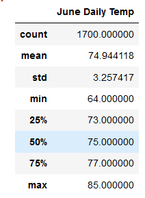
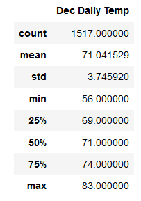

# surfs_up

## Overview

The purpose of this project was to determine whether the weather on the island of Oahu, Hawaii is conducive to opening a successful surf shop and ice cream shop. The first part of the project determined that precipitation levels are indeed conducive to running such a business. This second part of the analysis focused on comparing temperatures for the months of June and December to assess whether the proposed project could be sustainable year-round or only during part of the year. 

## Results

- Temperatures are very similar in June and December.
- December temperatures are slightly cooler on average that June, but the difference in mean temperature between the two is only three degrees (71 vs 74).
- December temperatures also have a greater range, which is worth noting particularly regarding the minimum recorded temperature of 56 degrees. 

## Summary
The fact that temperatures are so similar from months six months apart indicate a relatively stable year-round climate on the island. This reinforces the positive findings regarding precipitation earlier in the project. The only potential drawback is that the data demonstrate that temperatures can dip rather low in December - into the 50s. While this may not be that problematic to surfers who can simply don a warmer wetsuit, such temperatures may put a temporary damper on ice cream sales. 

Overall, though, Oahu comes out of this analysis looking like a great location for the proposed business venture.